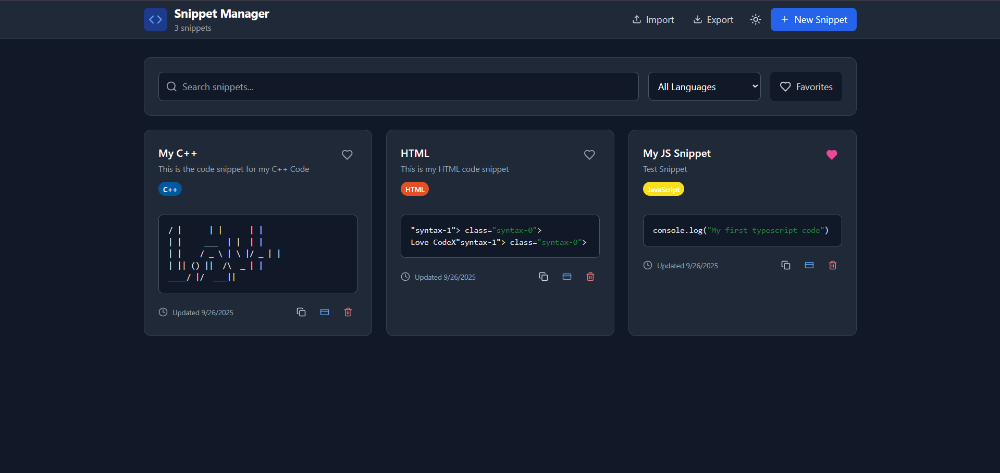

<p align="center">
  
</p>

Easily save, organize, and find your favorite code snippets in one place — never lose track of your useful code again.


## 📦 Tech Stack

- **React** – UI library  
- **TypeScript** – Type safety  
- **Vite** – Fast development bundler  
- **Tailwind CSS** / **PostCSS** – Styling   

---

## 🚀 Features

- Add, edit, and delete code snippets  
- Syntax highlighting for multiple languages  
- Tag snippets for easy organization  
- Search and filter snippets instantly  
- Save favorite snippets for quick access  
- Dark / Light theme toggle  
- Local storage support for offline usage  

---

## 📁 Folder Structure

```
src/
├── components/          # React components
│   ├── EmptyState.tsx
│   ├── Header.tsx
│   ├── SearchBar.tsx
│   ├── SnippetCard.tsx
│   ├── SnippetEditor.tsx
│   ├── SyntaxHighlighter.tsx
│   └── ThemeToggle.tsx
├── constants/           # Application constants
│   └── languages.ts
├── hooks/               # Custom React hooks
│   ├── useLocalStorage.ts
│   └── useTheme.ts
├── types/               # TypeScript type definitions
│   └── index.ts
├── utils/               # Utility functions
│   └── snippetStorage.ts
├── App.tsx              # Main application component
├── index.css            # Global styles
├── main.tsx             # Application entry point
└── site-env.d.ts        # Environment type definitions
```

---

## 💻 Getting Started

### Installation

1. Clone the repository:

```bash
git clone https://github.com/kirubelm1/Code-Snippet-Organizer.git
cd Code-Snippet-Organizer
```

2. Install dependencies:

```bash
npm install
# or
yarn install
```

3. Start the development server:

```bash
npm run dev
# or
yarn dev
```

Open your browser and navigate to the URL shown in the terminal (e.g., `http://localhost:5173/`).

### Build for Production

```bash
npm run build
# or
yarn build
```

Preview locally:

```bash
npm run preview
# or
yarn preview
```

---

## 🛠️ Scripts

| Command             | Description                                      |
|--------------------|--------------------------------------------------|
| `npm run dev`       | Start development server                         |
| `npm run build`     | Build production bundle                           |
| `npm run preview`   | Preview production build                          |
| `npm run lint`      | Run ESLint for code linting                       |
| `npm run typecheck` | Check TypeScript types without emitting files    |

---

## ✅ Contributing

Contributions are welcome!  

1. Fork the repository  
2. Create a new branch (`git checkout -b feature/foo`)  
3. Make your changes and test thoroughly  
4. Commit your changes (`git commit -m "Add feature foo"`)  
5. Push to the branch (`git push origin feature/foo`)  
6. Open a Pull Request  

Please follow the existing code style and run lint & type checks before submitting.

## Preview


---

## 📜 License

MIT License  
© 2025 Kirubel Mesfin 

Permission is hereby granted, free of charge, to any person obtaining a copy of this software and associated documentation files (the "Software"), to deal in the Software without restriction, including without limitation the rights to use, copy, modify, merge, publish, distribute, sublicense, and/or sell copies of the Software, subject to the conditions in the license.

---

## 💬 Acknowledgments & Resources


- [Vite](https://vitejs.dev/) – Bundler  
- [React](https://reactjs.org/) – UI library  
- [Tailwind CSS](https://tailwindcss.com/) – Styling  


